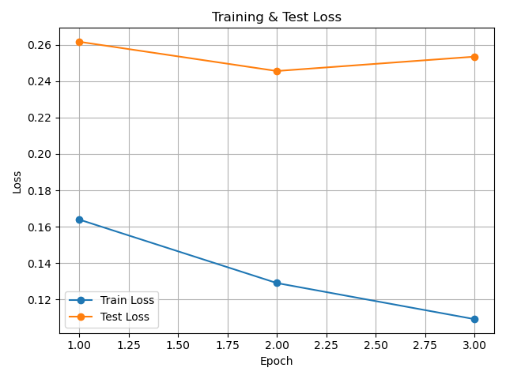
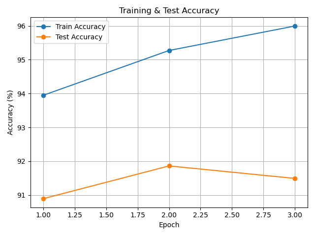
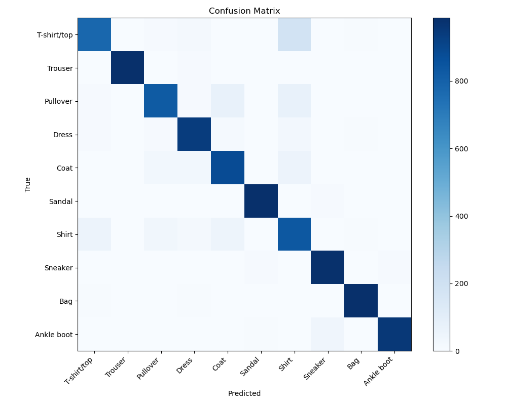
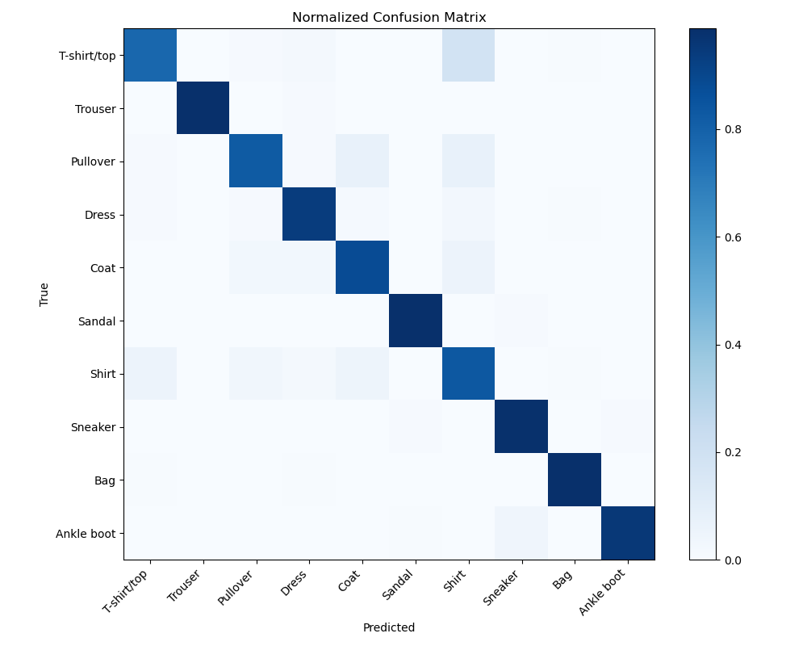
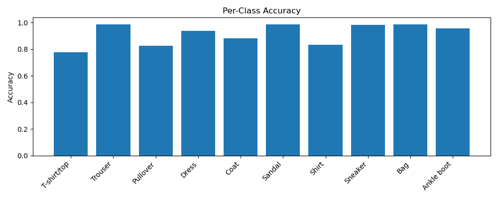
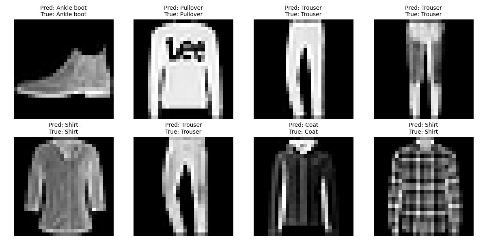
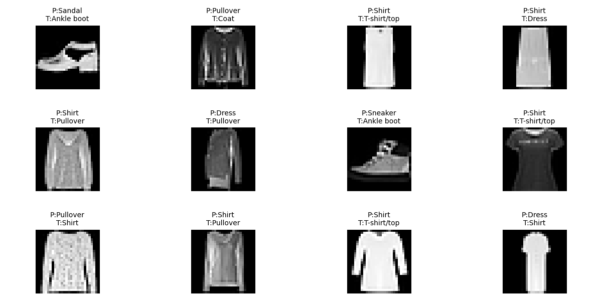

# CNN ile FashionMNIST Görüntü Sınıflandırma Projesi

Bu projede, FashionMNIST veri seti kullanılarak 10 sınıflı kıyafet görüntülerinin sınıflandırılması amacıyla bir Convolutional Neural Network (CNN) modeli geliştirilmiştir. Model, PyTorch framework’ü kullanılarak eğitilmiş ve test verisi üzerinde değerlendirilmiştir. Elde edilen sonuçlar; eğitim grafikleri, confusion matrix ve sınıf bazlı başarı metrikleri ile detaylı biçimde analiz edilmiştir.

## 1. Veri Seti Açıklaması

FashionMNIST, Zalando tarafından sağlanan ve klasik MNIST veri setine alternatif olarak tasarlanmış bir görüntü veri setidir. Veri seti, farklı kıyafet türlerine ait gri tonlamalı görüntülerden oluşmaktadır.

- Görüntü boyutu: 28 × 28 piksel  
- Kanal sayısı: 1 (grayscale)  
- Toplam sınıf sayısı: 10  
- Eğitim veri seti: 60.000 görüntü  
- Test veri seti: 10.000 görüntü  

Veriler PyTorch `FashionMNIST` sınıfı kullanılarak indirilmiş ve yüklenmiştir. Görüntüler, modele girdi olarak verilebilmesi için `ToTensor()` dönüşümü ile tensör formatına çevrilmiştir. Eğitim ve test aşamalarında mini-batch yaklaşımı kullanılmıştır.

### Sınıf Etiketleri

| ID | Sınıf Adı   |
| -- | ----------- |
| 0  | T-shirt/top |
| 1  | Trouser     |
| 2  | Pullover    |
| 3  | Dress       |
| 4  | Coat        |
| 5  | Sandal      |
| 6  | Shirt       |
| 7  | Sneaker     |
| 8  | Bag         |
| 9  | Ankle boot  |

## 2. Model Mimarisi

Bu projede kullanılan CNN mimarisi, temel görüntü özelliklerini öğrenmeye yönelik olarak tasarlanmış iki evrişim katmanı ve iki tam bağlı katmandan oluşmaktadır.

### Mimari Detaylar

**Evrişim Katmanı 1**
- Conv2D (1 → 32), kernel size = 3, padding = 1  
- ReLU aktivasyon  
- MaxPooling (2 × 2)  

**Evrişim Katmanı 2**
- Conv2D (32 → 64), kernel size = 3, padding = 1  
- ReLU aktivasyon  
- MaxPooling (2 × 2)  

**Düzleştirme (Flatten)**
- 64 × 7 × 7  

**Tam Bağlı Katmanlar**
- Linear (64 × 7 × 7 → 128) + ReLU  
- Linear (128 → 10)  

Çıkış katmanı, her sınıf için birer adet olmak üzere 10 adet skor (logits) üretmektedir. Kayıp fonksiyonu olarak `CrossEntropyLoss` kullanıldığı için softmax işlemi ayrıca uygulanmamıştır.

## 3. Eğitim Süreci

Model, eğitim veri seti üzerinde belirli epoch sayısı boyunca eğitilmiştir. Her epoch sonunda hem eğitim hem de test veri setleri üzerinde kayıp (loss) ve doğruluk (accuracy) değerleri hesaplanmıştır.

- Epoch sayısı: 3  
- Batch size: 64  
- Kayıp fonksiyonu: CrossEntropyLoss  

Eğitim sürecinde elde edilen metrikler liste halinde tutulmuş ve daha sonra grafikler halinde görselleştirilmiştir.

## 4. Eğitim Grafiklerinin Analizi

Eğitim sürecine ait grafikler proje kökündeki `images/` klasörüne kaydedilmiştir.

### 4.1 Training / Test Loss

Loss grafiği, modelin epoch’lar boyunca hatayı azaltma eğilimini göstermektedir. Eğitim kaybının düzenli biçimde azalması, modelin veri üzerindeki öğrenme yeteneğinin arttığını göstermektedir. Test kaybı ise modelin genelleme performansı hakkında fikir vermektedir.

### 4.2 Training / Test Accuracy

Accuracy grafiği, doğru sınıflandırma oranının epoch’lara göre değişimini göstermektedir. Eğitim doğruluğu ile test doğruluğu arasındaki farkın sınırlı olması, modelin aşırı öğrenme yapmadığını ve makul düzeyde genelleme sağladığını göstermektedir.

## 5. Başarı Metrikleri ve Performans Değerlendirmesi

Model performansı sadece genel doğruluk ile değil, daha detaylı analizler ile değerlendirilmiştir.

### 5.1 Confusion Matrix

Confusion matrix, gerçek sınıflar ile tahmin edilen sınıflar arasındaki ilişkiyi göstermektedir. Diyagonal üzerindeki değerler doğru sınıflandırmaları, diyagonal dışındaki değerler ise yanlış sınıflandırmaları temsil etmektedir.

### 5.2 Normalize Edilmiş Confusion Matrix

Normalize edilmiş confusion matrix, her sınıf için doğru ve yanlış tahmin oranlarını daha net biçimde göstermektedir. Bu analiz özellikle sınıflar arası karşılaştırma yapmak için kullanışlıdır.

### 5.3 Sınıf Bazlı Doğruluk (Per-Class Accuracy)

Bu grafik, modelin her bir sınıf üzerindeki doğruluk oranını göstermektedir. Görsel olarak benzer sınıflar (örneğin Shirt, T-shirt/top ve Pullover) diğer sınıflara kıyasla daha düşük doğruluk değerlerine sahip olabilmektedir.

## 6. Örnek Tahminler ve Yanlış Sınıflandırmalar

### 6.1 Örnek Tahminler

Bu görselde test veri setinden seçilen örnekler için modelin tahmin ettiği sınıflar ve gerçek etiketler birlikte gösterilmektedir.

### 6.2 Yanlış Sınıflandırılan Örnekler

Yanlış sınıflandırılan örneklerin büyük kısmı, görsel özellikleri birbirine benzeyen sınıflar arasında gerçekleşmektedir. Bu durum, modelin ayırt edici özellikleri öğrenme kapasitesi ile doğrudan ilişkilidir.

## 7. Proje Klasör Yapısı
cnn-final-projesi/
├── images/
│ ├── loss.png
│ ├── accuracy.png
│ ├── confusion_matrix.png
│ ├── confusion_matrix_normalized.png
│ ├── per_class_accuracy.png
│ ├── sample_predictions.png
│ └── misclassified_samples.png
├── notebooks/
│ └── cnn_fashionmnist.ipynb
├── data/
├── outputs/
└── README.md

## 8. Sonuç

Bu projede FashionMNIST veri seti üzerinde CNN tabanlı bir görüntü sınıflandırma modeli geliştirilmiş ve değerlendirilmiştir. Eğitim ve test metrikleri, modelin genel olarak başarılı bir performans sergilediğini göstermektedir. Özellikle confusion matrix ve sınıf bazlı doğruluk analizleri, modelin güçlü ve zayıf yönlerini ortaya koymuştur. Gelecek çalışmalarda veri artırma, daha derin ağ yapıları veya düzenlileştirme yöntemleri kullanılarak performansın artırılması mümkündür.

